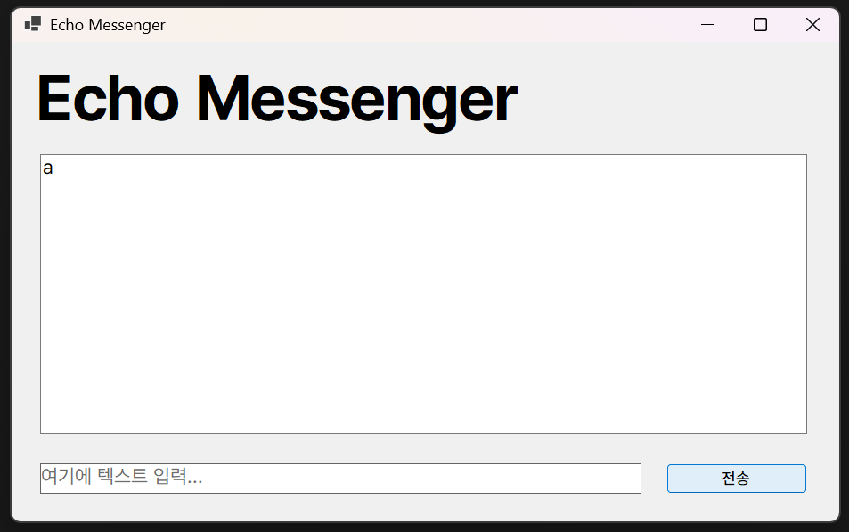
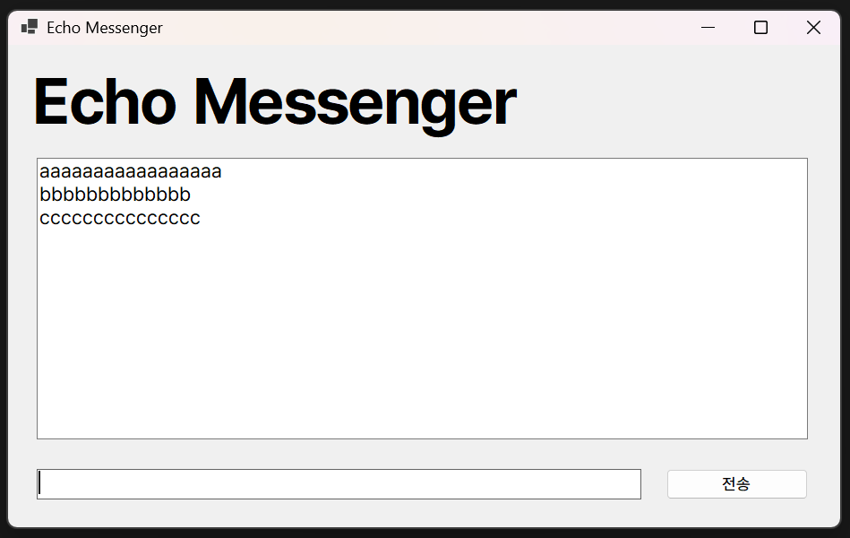
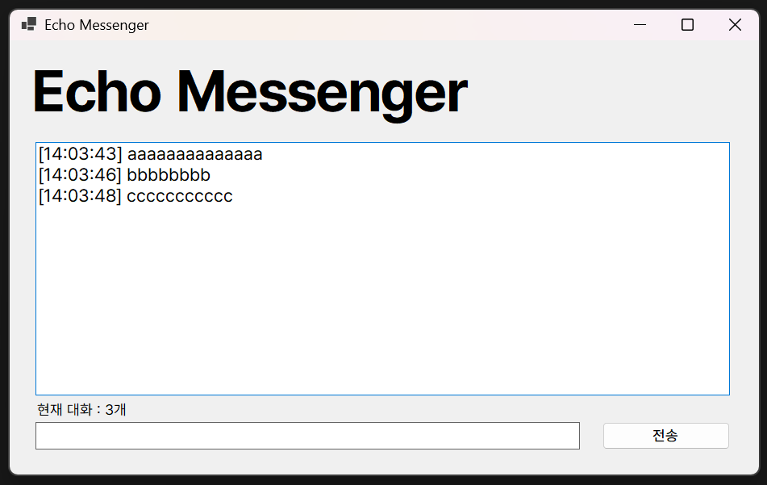
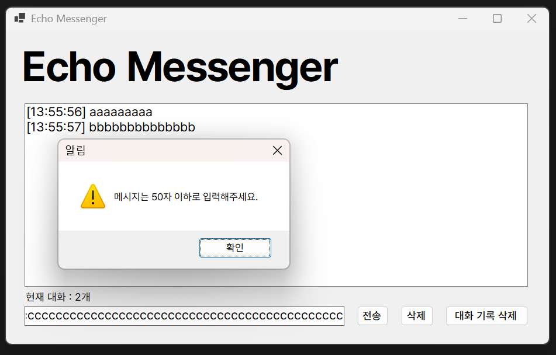
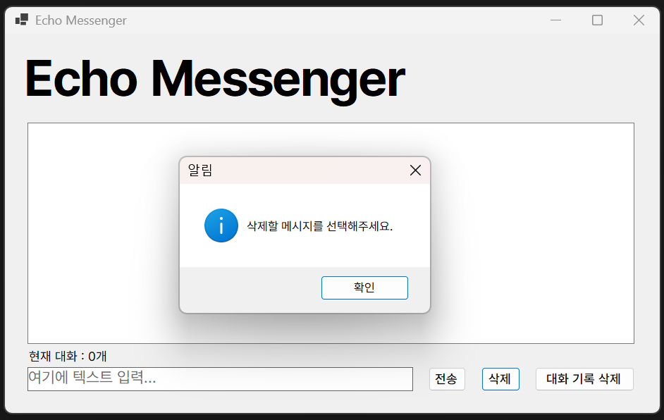

# 3주차 과제: 에코 메신저

## 개요
- C# 프로그래밍 학습
- 1줄 소개: 키보드의 입력을 받아 조작하여 출력하는 프로그램
- 사용한 플랫폼:
    - C#, .NET Windows Forms, Visual Studio, Github
- 사용한 컨트롤:
    - Label, TextBox, ListBox, Button
- 사용한 기술과 구현한 기능:
    - Visual Studio를 이용한 UI 디자인
    - string 클래스에 있는 메소드를 이용한 문자열 조작
    - DateTime 클래스를 이용한 현재 시간 정보 출력
    - MessageBox를 이용한 경고 메시지 출력
    - KeyDown 이벤트를 이용한 특정 입력에 대한 반응 출력
    - ActiveControl 속성을 이용한 자동 포커스 기능
    - $"" 형태의 문자열 처리를 이용헤 문자열에 변수 추가

## 실행 화면 (과제1)
- 과제1 코드의 실행 스크린샷

- 과제 내용
    - Label(표시), TextBox(입력), Button(전송), ListBox(대화창)를 적절히 배치합니다.
    - 전송 버튼 클릭 시 TextBox의 텍스트를 ListBox의 항목(Items)으로 추가합니다.
    - 추가 직후 TextBox의 내용을 비워(Clear) 다음 입력을 준비합니다.

- 구현 내용과 기능 설명
    - 입력창에 메시지를 입력하고 전송 버튼을 클릭하면 메시지가 대화창에 추가된다.
    - 반복할 경우 메시지가 대화창에 하나 씩 추가된다.
    - 텍스트를 전송 버튼을 눌러 추가할 경우 입력창에 있던 텍스트가 초기화된다.

## 실행 화면 (과제2)
- 과제2 코드의 실행 스크린샷

- 과제 내용
    - 전송 후에 마우스로 입력창을 다시 클릭하지 않아도 되도록 커서를 자동으로 입력창에 둡니다.
    - 마우스 클릭 대신 키보드의 Enter 키를 눌러도 메시지가 전송되도록 합니다.
    - 내용이 없는 빈 문자열이나 공백(Space)만 있을 때는 메시지가 전송되지 않도록 방지합니다.

- 구현 내용과 기능 설명
    - send_Message라는 함수를 만들어 다양한 이벤트에 동시에 적용할 수 있게 했다.
    - Enter 키의 입력을 감지해 전송 버튼을 클릭하는 것과 동일하게 메시지를 대화창에 추가한다.
    - 입력창의 메시지가 공백일 경우 전송 버튼이나 Enter 키가 동작하지 않는다.
    - 메시지를 전송할 시 자동으로 입력창에 포커스를 둔다.

## 실행 화면 (과제3)
- 과제3 코드의 실행 스크린샷

- 과제 내용
    - 메시지 앞에 현재 시간([HH:mm:ss])을 자동으로 결합하여 리스트에 출력합니다.
    - 현재 리스트에 쌓인 총 메시지 개수를 계산하여 하단 Label에 실시간으로 업데이트합니다.
        - 예: "현재 대화: 12개"
    -사용자가 입력한 메시지의 앞 뒤 불필요한 공백을 Trim() 함수로 제거하여 저장합니다.

- 구현 내용과 기능 설명
    - 대화창에 출력되는 메시지 앞에 [HH:mm:ss]의 형태로 타임스탬프가 붙는다.
    - 현재 대화창에 있는 메시지의 개수를 세어 실시간으로 업데이트한다.
    - 입력창에 입력된 텍스트를 대화창으로 전송할 때 앞 뒤에 있는 공백을 제거한다.

## 실행 화면 (과제4)
- 과제4 코드의 실행 스크린샷

- 과제 내용
    - ListBox에서 특정 메시지를 마우스로 클릭하고 '삭제' 버튼을 누르면 해당 항목만 목록에서 제거합니다. (단, 선택하지 않고 삭제 시 발생하는 에러를 예외 처리해야 함)
    - '대화 기록 삭제' 버튼을 클릭하면 리스트의 모든 내용을 한 번에 지웁니다.
    - 입력창의 글자 수를 50자로 제한하고, 초과 시 사용자에게 경고 메시지를 띄우거나 전송을 차단합니다.

- 구현 내용과 기능 설명
    - 입력창의 메시지가 50자를 넘으면 경고 메시지를 출력하고 메시지가 초기화된다.
    - 대화 기록 삭제 버튼을 눌러 대화창에 있는 모든 메시지를 제거한다.
    - 삭제할 메시지를 선택하고 삭제 버튼을 누르면 그 메시지가 제거된다.
        - 만약 삭제할 메시지를 선택하지 않으면 경고 메시지를 출력한다.

## 배운 내용
- $""의 형태를 통해 손쉽게 문자열에 변수를 삽입할 수 있다는 것을 배움.
- ListBox를 조작하는 메소드를 다수 배웠음. (ListBox.Items.Add, Remove, Clear)
- string에 관련된 메소드를 다수 배우고, 문자열을 조작하는 방법을 배웠음.
- DateTime 클래스를 알아보고, 현재 시간을 출력하고 형태를 조작하는 방법을 배움.